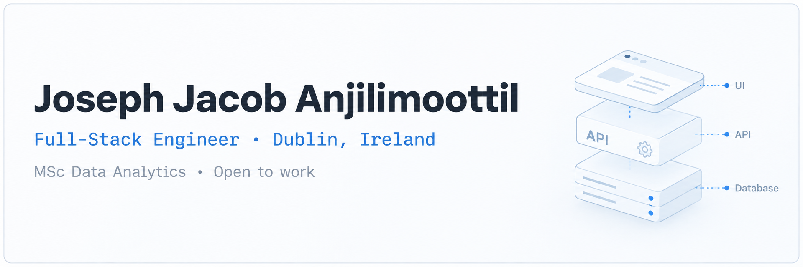

<!--
  BANNERS: upload BOTH images into an `assets/` folder in this repo:
    assets/joseph-banner-light.png
    assets/joseph-banner-dark.png
  GitHub automatically shows the right one for the viewer's theme.
-->
<picture>
  <source media="(prefers-color-scheme: dark)" srcset="assets/joseph-banner-dark.png">
  <source media="(prefers-color-scheme: light)" srcset="assets/joseph-banner-light.png">
  
</picture>

<!-- Typing line: blue that reads well on both themes -->

  
  
  

  
  
  

---

## 🎯 At a glance

Full-Stack Engineer in **Dublin, Ireland** with production experience on a payments platform handling **150k+ daily transactions**. Promoted twice in 22 months (Intern → SDE 1 → SDE 2). I ship end-to-end: Django REST APIs, React/TypeScript frontends, async Python services, AWS infrastructure, and production ML on Bedrock.

**Looking for:** full-stack, backend, data and ML engineering roles — Dublin or remote.

---

## 🛠️ Stack

<!-- Flat badges with GitHub-native greys/blues so they sit calmly in both themes -->

 

**Strongest in:** Python · Django REST · PostgreSQL · React/TypeScript · AWS · Spark · PyTorch

---

## 🚀 Featured Projects & Portfolio

| Project | What it does | Stack |
| --- | --- | --- |
| <a href="https://github.com/JosephJ7/moby-dublin-telemetry" target="_blank" rel="noopener noreferrer"><b>Moby Dublin — Spark telemetry</b></a> | Event-time-windowed Spark Structured Streaming pipeline with checkpointed, fault-tolerant aggregation for fleet telemetry. 14% fewer duplicate GPS records. | `Spark` `AWS S3` `MongoDB` `Parquet` |
| <a href="https://github.com/JosephJ7/Alzheimer-s-Disease-detection-using-Multi-IT-Transformer" target="_blank" rel="noopener noreferrer"><b>Alzheimer's detection — Multi-IT Transformer</b></a> | Interpretable transformer with triplet attention staging Alzheimer's across 4 classes on 44,000 MRI scans, benchmarked against 4 CNN baselines. | `PyTorch` `Transformers` `A100` |
| **AI support chat — Amazon Bedrock** *(private, Easebuzz)* | Production LLM support assistant grounded in internal product policy, with guardrails, conversation state and server-side model access. | `Bedrock` `Python` `Django` |
| <a href="https://github.com/JosephJ7/CNN--Skin-Caner-Detection" target="_blank" rel="noopener noreferrer"><b>Skin cancer classification</b></a> | CNN lesion classifiers (InceptionV3, MobileNetV2, VGG) with transfer learning and class-weighted loss. 86% accuracy. | `TensorFlow` `Keras` |

<b>📂 More projects</b>

 

- <a href="https://github.com/JosephJ7/Data-mining-and-machine-learning-project" target="_blank" rel="noopener noreferrer"><b>Data mining & ML</b></a> — End-to-end analysis: cleaning, feature engineering, EDA and supervised models under cross-validation.
- <a href="https://github.com/JosephJ7/TAPF-SCM" target="_blank" rel="noopener noreferrer"><b>Akshaya Patra fleet tracker</b></a> — Java logistics tool tracking food vans from kitchens to schools, replacing manual paper logs.

  

---

## 💼 Experience

**Easebuzz — SDE 2** · Jan 2023 – Nov 2024
Payments platform handling **150k+ daily transactions**.

- ⚡ Cut backend load by **70%** with async Python pipelines
- ⏱️ Reduced merchant onboarding from **3 days → 30 minutes** for **8,000+ merchants**
- 🤖 Built the first in-house LLM support assistant on Amazon Bedrock

---

## 🎓 Education

- **MSc Data Analytics** — National College of Ireland, Dublin
- **B.Tech Computer Science & Engineering** — Symbiosis Institute of Technology, Pune

---

## 🏆 Recognition

- 🏅 **Employee of the Quarter** within 3 months of joining Easebuzz
- 🚀 **Promoted twice in 22 months** — Intern → SDE 1 → SDE 2
- 🥈 **Rank 2**, SIT CodeChef "The Bug Detective"

---

## 📈 GitHub Activity

<!-- Stats cards: theme swaps with the viewer's GitHub theme -->
<picture>
  <source media="(prefers-color-scheme: dark)" srcset="https://github-profile-summary-cards.vercel.app/api/cards/stats?username=JosephJ7&theme=github_dark">
  
</picture>
<picture>
  <source media="(prefers-color-scheme: dark)" srcset="https://github-profile-summary-cards.vercel.app/api/cards/most-commit-language?username=JosephJ7&theme=github_dark">
  
</picture>

  

<!-- Contribution graph: blue in dark mode, deeper blue in light mode -->
<picture>
  <source media="(prefers-color-scheme: dark)" srcset="https://ghchart.rshah.org/58A6FF/JosephJ7">
  
</picture>

---

### Ready to hire? Let's talk.

**Open to full-stack, backend, data and ML engineering roles — Dublin or remote.**

<a href="mailto:josephjacobie2001@gmail.com" target="_blank" rel="noopener noreferrer">Email me</a> · <a href="https://www.linkedin.com/in/joseph-jacob-anjilimoottil/" target="_blank" rel="noopener noreferrer">Message me on LinkedIn</a> — I reply within 24 hours.

