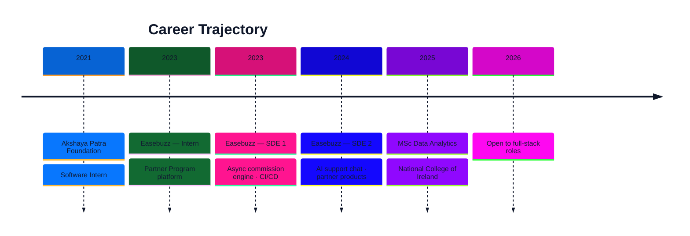

<!-- Custom terminal-style status header -->
<pre align="center" style="font-family: 'JetBrains Mono', 'SF Mono', monospace; font-size: 13px; line-height: 1.5; background: #0f172a; color: #e2e8f0; padding: 18px 24px; border-radius: 12px; display: inline-block; text-align: left; box-shadow: 0 0 0 1px #1e293b, 0 10px 30px -10px rgba(0,0,0,0.5);">
user@dublin:~$ whoami
Joseph Jacob Anjilimoottil
user@dublin:~$ cat role.txt
Full-Stack Engineer · MSc Data Analytics · Open to Work
user@dublin:~$ uptime
system online · Dublin, IE · promoted twice in 22 months
user@dublin:~$ _
</pre>

  

  
  
  
  

---

## 🧭 Mission Control

<table>
  <tr>
    <td width="55%" valign="top">

### 👋 About me

I'm a **Full-Stack Engineer** based in **Dublin, Ireland**, with a fresh **MSc in Data Analytics** from the National College of Ireland and production experience at **Easebuzz**, where I was promoted twice in 22 months (Intern → SDE 1 → SDE 2).

I own products end to end — from React dashboards and Django REST APIs to async Python pipelines and AWS-backed ML services. The work is measurable: faster onboarding, cheaper processing, and self-serve scale.

> *"I don't just write code; I design systems that solve real problems."*

</td>
    <td width="45%" valign="top">

### 📡 Live status

| Signal | Value |
|--------|-------|
| **Role** | Full-Stack Engineer |
| **Base** | Dublin, IE |
| **Education** | MSc Data Analytics · NCI |
| **Last role** | SDE 2 · Easebuzz |
| **Availability** | 🟢 Open to full-time roles |
| **Focus** | Full-stack · Backend · Data · ML |

</td>
  </tr>
</table>

<b>🏆 Recognition & highlights (click to expand)</b>

- 🏅 **Employee of the Quarter** within 3 months of joining Easebuzz
- 🚀 **Promoted twice in 22 months** — Intern → SDE 1 → SDE 2
- 🥈 **Rank 2**, SIT CodeChef "The Bug Detective"
- 📉 Cut backend processing load by **70%** across 150,000+ daily transactions
- ⏱️ Collapsed merchant onboarding from **3 days → 30 minutes** for 8,000+ merchants
- 💰 Contributed to **30% gross revenue growth** via scaled onboarding
- 🚀 Reduced deployment time from **2 days → 15 minutes** across 10 services
- 🌐 Built reusable Django REST infrastructure serving **50,000+ partners**

---

## 🛠️ Stack

<!-- Skill meters -->
| Skill | Level |
|-------|-------|
| Python | `███████████████████████████████████████████████░░░` 95% |
| Django / REST | `██████████████████████████████████████████████░░` 92% |
| PostgreSQL | `█████████████████████████████████████████████░░░` 88% |
| React / TypeScript | `████████████████████████████████████████████░░░░` 86% |
| AWS / DevOps | `███████████████████████████████████████████░░░░░` 85% |
| Apache Spark | `███████████████████████████████████████████░░░░░` 84% |
| PyTorch / ML | `██████████████████████████████████████████░░░░░░` 82% |

  
  
  
  
  
  
  
  
  
  
  
  

---

## 💼 Experience

### Easebuzz · Jan 2023 — Nov 2024

At Easebuzz I owned full-stack products behind a payments platform handling **150,000+ daily transactions** — from React self-serve dashboards and Django REST APIs to async decision pipelines in Python asyncio and AWS-deployed ML services.

| Impact | Detail |
|--------|--------|
| ⚡ **70% load cut** | Replaced synchronous logic with async Python pipelines |
| ⏱️ **30 min onboarding** | Down from 3 days for **8,000+ merchants** |
| 💰 **30% revenue growth** | Via scaled self-serve merchant onboarding |
| 🚀 **15 min deploys** | Down from 2 days across 10 services (Docker + Jenkins) |
| 🌐 **50,000+ partners** | Reusable Django REST infrastructure, zero major incidents |
| 🤖 **AI support chat** | First in-house LLM assistant on Amazon Bedrock |

---

## 🚀 Featured Projects

<table>
  <tr>
    <td width="50%" valign="top">

### 🚌 Moby Dublin — Spark telemetry

Event-time-windowed Spark Structured Streaming pipeline with fault-tolerant aggregation for a distributed fleet telemetry system.

- 14% reduction in duplicate GPS records
- Checkpointed, fault-tolerant aggregation
- Partitioned Parquet lake on S3

`Apache Spark` · `AWS S3` · `MongoDB` · `Parquet`

</td>
    <td width="50%" valign="top">

### 🧠 Alzheimer's disease detection

Interpretable Multi-IT Transformer with Triplet Attention staging Alzheimer's across 4 classes on 44,000 MRI scans.

- 4-class staging with attention-map interpretability
- Benchmarked against 4 CNN baselines
- Trained on NVIDIA A100 with mixed precision

`PyTorch` · `Transformers` · `NVIDIA A100`

</td>
  </tr>
  <tr>
    <td width="50%" valign="top">

### 💬 AI support chat — Amazon Bedrock

Production LLM-powered customer support chat at Easebuzz, grounded in internal product policy and deployed across merchant support operations.

- Retrieval over internal docs for grounded answers
- Django service with guardrails & conversation state
- Server-side model access, no key exposure

`Amazon Bedrock` · `Python` · `Django`

</td>
    <td width="50%" valign="top">

### 🩺 Skin cancer classification

CNN models for skin lesion classification — InceptionV3, MobileNetV2 and VGG variants with augmentation.

- 86% classification accuracy
- Transfer learning + fine-tuning
- Class-weighted loss for imbalance

`TensorFlow` · `Keras` · `Transfer Learning`

</td>
  </tr>
</table>

<b>📂 More projects (click to expand)</b>

- **[Data mining & ML](https://github.com/JosephJ7/Data-mining-and-machine-learning-project)** — End-to-end analysis with cleaning, feature engineering, EDA and supervised models in scikit-learn under cross-validation.
- **[Akshaya Patra fleet tracker](https://github.com/JosephJ7/TAPF-SCM)** — Java-based logistics tool tracking food vans from kitchens to schools, replacing manual paper logs.

---

## 🎓 Education

| Degree | Institution | Period |
|--------|-------------|--------|
| **MSc Data Analytics** | National College of Ireland, Dublin | Jan 2025 — Jan 2026 |
| **B.Tech Computer Science & Engineering** | Symbiosis Institute of Technology, Pune | Jul 2019 — May 2023 |
| **Honours in AI & ML** | Symbiosis Institute of Technology, Pune | Jul 2019 — May 2023 |

---

## 📈 GitHub Activity

<table>
  <tr>
    <td>
      
    </td>
    <td>
      
    </td>
  </tr>
</table>

---

## 🌐 Let's Connect

  
  
  

---

### 💼 Currently open to full-stack, backend, data and ML engineering roles in Dublin and remote.

If you're hiring or know of a role that fits, I'd love to chat.

