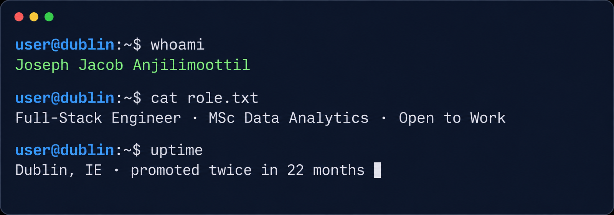

<!--
  BANNER: upload `joseph-terminal-banner.png` to this repo (e.g. into an `assets/` folder)
  and it will render below. Replace the src path if you put it somewhere else.
-->

  

  
  
  

---

## 👋 About me

I'm a **Full-Stack Engineer** based in **Dublin, Ireland**, with a fresh **MSc in Data Analytics** from the National College of Ireland and production experience at **Easebuzz**, where I was promoted twice in 22 months (Intern → SDE 1 → SDE 2).

I own products end to end — from React dashboards and Django REST APIs to async Python pipelines and AWS-backed ML services. The work is measurable: faster onboarding, cheaper processing, and self-serve scale.

> *"I don't just write code; I design systems that solve real problems."*

**Currently:** open to full-stack, backend, data and ML engineering roles — Dublin or remote.

<b>🏆 Recognition & highlights (click to expand)</b>

 

- 🏅 **Employee of the Quarter** within 3 months of joining Easebuzz
- 🚀 **Promoted twice in 22 months** — Intern → SDE 1 → SDE 2
- 🥈 **Rank 2**, SIT CodeChef "The Bug Detective"
- 📉 Cut backend processing load by **70%** across 150,000+ daily transactions
- ⏱️ Collapsed merchant onboarding from **3 days → 30 minutes** for 8,000+ merchants
- 💰 Contributed to **30% gross revenue growth** via scaled onboarding
- 🚀 Reduced deployment time from **2 days → 15 minutes** across 10 services
- 🌐 Built reusable Django REST infrastructure serving **50,000+ partners**

---

## 🛠️ Stack

  
  
  
  
  
  
  
  
  
  
  
  

**Strongest in:** Python · Django REST · PostgreSQL · React/TypeScript · AWS · Spark · PyTorch

---

## 💼 Experience

### Easebuzz — Intern → SDE 1 → SDE 2 · Jan 2023 — Nov 2024

Owned full-stack products behind a payments platform handling **150,000+ daily transactions** — React self-serve dashboards, Django REST APIs, async decision pipelines in Python asyncio, and AWS-deployed ML services.

| Impact | Detail |
|--------|--------|
| ⚡ **70% load cut** | Replaced synchronous logic with async Python pipelines |
| ⏱️ **30 min onboarding** | Down from 3 days for **8,000+ merchants** |
| 💰 **30% revenue growth** | Via scaled self-serve merchant onboarding |
| 🚀 **15 min deploys** | Down from 2 days across 10 services (Docker + Jenkins) |
| 🌐 **50,000+ partners** | Reusable Django REST infrastructure, zero major incidents |
| 🤖 **AI support chat** | First in-house LLM assistant, built on Amazon Bedrock |

### Akshaya Patra Foundation — Software Intern · 2021

Built a Java logistics tool tracking food vans from kitchens to schools, replacing manual paper logs.

---

## 🚀 Featured Projects

<table>
  <tr>
    <td width="50%" valign="top">

### 🚌 Moby Dublin — Spark telemetry

Event-time-windowed Spark Structured Streaming pipeline with fault-tolerant aggregation for a distributed fleet telemetry system.

- 14% reduction in duplicate GPS records
- Checkpointed, fault-tolerant aggregation
- Partitioned Parquet lake on S3

`Apache Spark` · `AWS S3` · `MongoDB` · `Parquet`

</td>
    <td width="50%" valign="top">

### 🧠 Alzheimer's disease detection

Interpretable Multi-IT Transformer with Triplet Attention staging Alzheimer's across 4 classes on 44,000 MRI scans.

- 4-class staging with attention-map interpretability
- Benchmarked against 4 CNN baselines
- Trained on NVIDIA A100 with mixed precision

`PyTorch` · `Transformers` · `NVIDIA A100`

</td>
  </tr>
  <tr>
    <td width="50%" valign="top">

### 💬 AI support chat — Amazon Bedrock

Production LLM-powered customer support chat at Easebuzz, grounded in internal product policy and deployed across merchant support operations.

- Retrieval over internal docs for grounded answers
- Django service with guardrails & conversation state
- Server-side model access, no key exposure

`Amazon Bedrock` · `Python` · `Django`

</td>
    <td width="50%" valign="top">

### 🩺 Skin cancer classification

CNN models for skin lesion classification — InceptionV3, MobileNetV2 and VGG variants with augmentation.

- 86% classification accuracy
- Transfer learning + fine-tuning
- Class-weighted loss for imbalance

`TensorFlow` · `Keras` · `Transfer Learning`

</td>
  </tr>
</table>

<b>📂 More projects (click to expand)</b>

 

- **[Data mining & ML](https://github.com/JosephJ7/Data-mining-and-machine-learning-project)** — End-to-end analysis with cleaning, feature engineering, EDA and supervised models in scikit-learn under cross-validation.
- **[Akshaya Patra fleet tracker](https://github.com/JosephJ7/TAPF-SCM)** — Java-based logistics tool tracking food vans from kitchens to schools, replacing manual paper logs.

---

## 🎓 Education

| Degree | Institution | Period |
|--------|-------------|--------|
| **MSc Data Analytics** | National College of Ireland, Dublin | Jan 2025 — Jan 2026 |
| **B.Tech Computer Science & Engineering** | Symbiosis Institute of Technology, Pune | Jul 2019 — May 2023 |
| **Honours in AI & ML** | Symbiosis Institute of Technology, Pune | Jul 2019 — May 2023 |

---

## 📈 GitHub Activity

  

---

## 🌐 Let's Connect

  
  

**Open to full-stack, backend, data and ML engineering roles in Dublin and remote.**
If you're hiring or know of a role that fits, I'd love to chat.

